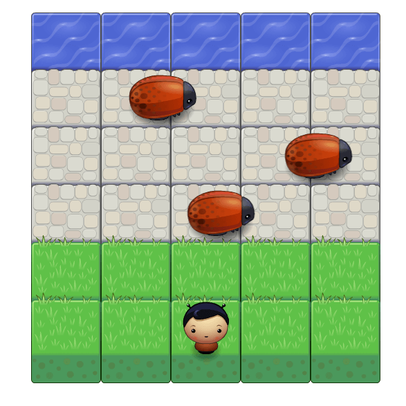

# Classic Arcade Game Clone(Frogger)

### About

Third project from the Front-End Web Developer Nanodegree in
<a href="https://www.udacity.com" target="_blank">Udacity</a>:
Using visual asset and engine.js provided by Udacity in start code; add a number of entities to the game including player character and enemies to recreate the classic arcade game Frogger with Object-Oriented JavaScript and HTML5 Canvas.

### How to run the game?

Download the repository in your computer, unzip the file and open "index.html" to play the game.

### How to play?

To play the game, use the arrow keys from your keyboard to move your player up, right, down and left to lead the player character to the water.

### Screenshot of Game

